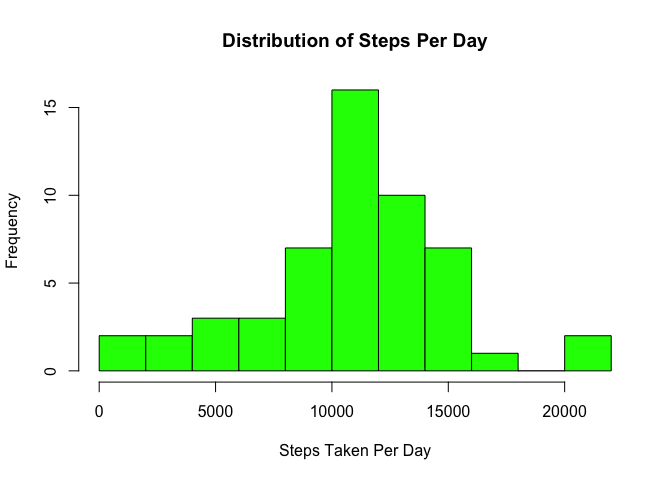
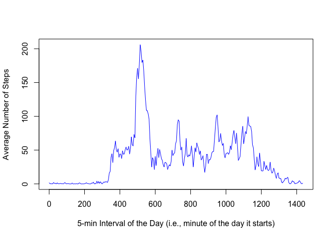
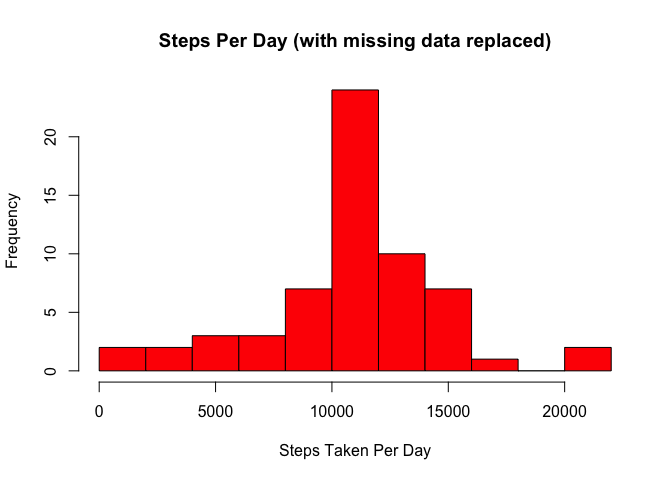
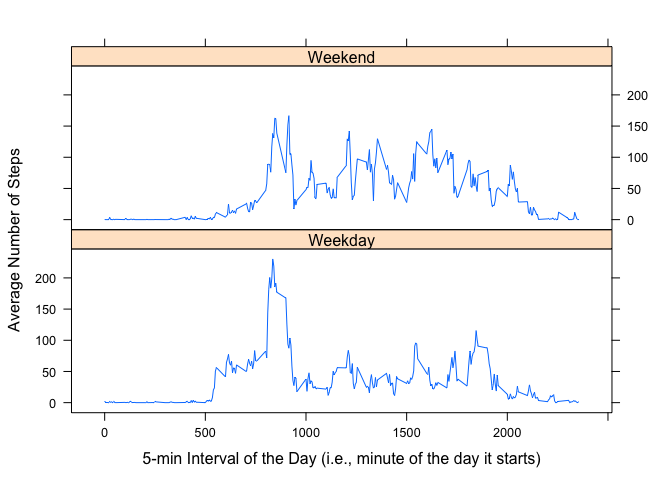

# Reproducible Research: Peer Assessment 1


##Personal Activity Data Analysis##

This assignment makes use of data from a personal activity monitoring device. This device collects data at 5 minute intervals through out the day. The data consists of two months of data from an anonymous individual collected during the months of October and November, 2012 and include the number of steps taken in 5 minute intervals each day.


## Loading and preprocessing the data

The activity data was downloaded as the file activity.csv from the URL 
https://d396qusza40orc.cloudfront.net/repdata%2Fdata%2Factivity.zip
on July 13, 2015 at 2:20p PDT

The contents of this file were used to generate a data.frame


```r
activityDF <- read.csv("./activity.csv", header=TRUE)

head(activityDF)
```

```
##   steps       date interval
## 1    NA 2012-10-01        0
## 2    NA 2012-10-01        5
## 3    NA 2012-10-01       10
## 4    NA 2012-10-01       15
## 5    NA 2012-10-01       20
## 6    NA 2012-10-01       25
```


## What is mean total number of steps taken per day?

A new data.frame (stepsPerDayDF) represents the total number of steps taken each day of the testing period.


```r
# Generate a data.frame of the sum of steps for each date, excluding NA values for steps
stepsPerDayDF <- aggregate(activityDF$steps[!is.na(activityDF$steps)], 
                           by=list(activityDF$date[!is.na(activityDF$steps)]), 
                           sum)

# Give the columns of stepsPerDayDF more meaningful names
names(stepsPerDayDF) <- c("date", "steps")
```

The total number of steps taken per day over the test period is represented as a distribution in the histogram below.


```r
hist(stepsPerDayDF$steps, col="green", breaks=10, main="Distribution of Steps Per Day",
     xlab="Steps Taken Per Day")
```

 

The *mean* number of steps taken each day over the test period is


```r
mean(stepsPerDayDF$steps)
```

```
## [1] 10766.19
```

The *median* number of steps taken each day over the test period is


```r
median(stepsPerDayDF$steps)
```

```
## [1] 10765
```


## What is the average daily activity pattern?

To examine the average daily pattern of activity, the number of steps taken over each five minute interval of the day was averaged over all days of the testing period and that data was stored in the data.frame intervalMeanDF. 


```r
# Average the number of steps at each five minute interval over all days
# Assign to data.frame 'intervalMeanDF'
intervalMeanDF <- aggregate(activityDF$steps[!is.na(activityDF$steps)], by=list(activityDF$interval[!is.na(activityDF$steps)]), mean)

# Give the columns of intervalMeanDF more meaningful names
names(intervalMeanDF) <- c("interval", "meanSteps")
```

In the original data the timing of each interval were designated by an integer coding the hour and minute of a 24-hour day (i.e., hhmm).  These values are converted to minutes during a 24-hour period (i.e., 0-1440) to provide for a smoother plot of the average daily activity.


```r
# For plotting add the column 'minutes', i.e., the time interval as a direct count of 
# minutes of the day
for (n in 1:length(intervalMeanDF$interval))  {
    minutesRemainder <- intervalMeanDF$interval[n] %% 100L
    hours <- intervalMeanDF$interval[n] %/% 100L
    intervalMeanDF$minutes[n] <- (60L*hours) + minutesRemainder
}

head(intervalMeanDF[11:16,])
```

```
##    interval meanSteps minutes
## 11       50 0.3018868      50
## 12       55 0.1320755      55
## 13      100 0.3207547      60
## 14      105 0.6792453      65
## 15      110 0.1509434      70
## 16      115 0.3396226      75
```

```r
plot(intervalMeanDF$minutes, intervalMeanDF$meanSteps, type="l", 
     xlab= "5-min Interval of the Day (i.e., minute of the day it starts)", 
     ylab= "Average Number of Steps", col="blue" , lwd=1)
```

 

The 5-minute interval with the maximum activity starts at 8:35 am:


```r
intervalMeanDF$interval[intervalMeanDF$meanSteps==max(intervalMeanDF$meanSteps)]
```

```
## [1] 835
```


## Imputing missing values

The total number of rows with missing data is 2304.


```r
length(activityDF$steps[is.na(activityDF$steps)])
```

```
## [1] 2304
```

We can take this set of rows and insert a value representing the mean for that interval over all days examined.


```r
# Start with the same data as in activityDF and replace NA values with the mean 
# interval value
completedActivityDF <- activityDF
for (n in 1:nrow(completedActivityDF))  {
    if (is.na(completedActivityDF$steps[n]))  {
        completedActivityDF$steps[n] <- intervalMeanDF$meanSteps[
                    intervalMeanDF$interval==completedActivityDF$interval[n]
                    ]
    }
}
```

Now, we can look at a histogram, the mean and the mode for this "completed" data set.


```r
# Generate a data.frame of the sum of steps for each date
completedStepsPerDayDF <- aggregate(completedActivityDF$steps, 
                           by=list(activityDF$date), 
                           sum)

# Give the columns of stepsPerDayDF more meaningful names
names(completedStepsPerDayDF) <- c("date", "steps")
```

Make a histogram of the total number of steps taken each day


```r
hist(completedStepsPerDayDF$steps, col="red", breaks=10, 
     main="Steps Per Day (with missing data replaced)", xlab="Steps Taken Per Day")
```

 

The *mean number of steps taken each day does not change* when the missing values are replaced with the interval mean.


```r
mean(completedStepsPerDayDF$steps)
```

```
## [1] 10766.19
```

However, after replacing those missing values with the mean value, *the interval mean value becomes the new median value*.


```r
median(completedStepsPerDayDF$steps)
```

```
## [1] 10766.19
```


## Are there differences in activity patterns between weekdays and weekends?

Add a "weekday" column for the day of the week for each date in the testing period (e.g., "Monday", "Tuesday", etc.) and add a "dayType" column that will designate whether each of these dates is a "Weekday" or a "Weekend" day.


```r
# Use the ymd() function (from the lubridate package) to generate a column with the day 
# of the week for each date in the testing period.
library(lubridate)
completedActivityDF$weekday <- weekdays(ymd(completedActivityDF$date))

# Create a vector (will be a column) designating "Weekend" or "Weekday"
dayTypeVector <- vector()
for (n in 1:length(completedActivityDF$weekday))  {
    if (completedActivityDF$weekday[n]=="Saturday" 
        | completedActivityDF$weekday[n]=="Sunday")
        dayTypeVector <- c(dayTypeVector, "Weekend")
    else  
        dayTypeVector <- c(dayTypeVector, "Weekday")
}
completedActivityDF$dayType <- factor(dayTypeVector)
```

Plot the daily activity of both weekdays and weekend days by creating two time-series plots of the average number of steps taken in each 5-minute interval of the day over the entire test period.


```r
# Average the number of steps at each five minute interval over all days
# Assign to data.frame 'weekdayDF'
weekdayDF <- aggregate(completedActivityDF$steps[completedActivityDF$dayType=="Weekday"], 
                       by=list(completedActivityDF$interval[
                           completedActivityDF$dayType=="Weekday"]), 
                       mean)

# Create another vector/column designating these dates as "Weekday" factor
dayTypeVector <- rep("Weekday", nrow(weekdayDF))

weekdayDF <- cbind(weekdayDF, as.factor(dayTypeVector))


# Average the number of steps at each five minute interval over all days
# Assign to data.frame 'weekendDF'
weekendDF <- aggregate(completedActivityDF$steps[completedActivityDF$dayType=="Weekend"], by=list(completedActivityDF$interval[completedActivityDF$dayType=="Weekend"]), mean)

# Create another vector/column designating these dates as "Weekend" factor
dayTypeVector <- rep("Weekend", nrow(weekendDF))

weekendDF <- cbind(weekendDF, as.factor(dayTypeVector))


allDaysDF <- rbind(weekdayDF, weekendDF)

# Give the columns of allDaysDF more meaningful names
names(allDaysDF) <- c("interval", "meanSteps", "dayType")
```

In the original data the timing of each interval was designated by an integer coding the hour and minute of a 24-hour day (i.e., hhmm).  These values are converted to minutes during a 24-hour period (i.e., 0-1440) to provide for a smoother plot of the average daily activity.


```r
# For plotting add the column 'minutes', i.e., the time interval as a direct count of 
# minutes of the day
for (n in 1:nrow(allDaysDF))  {
    minutesRemainder <- allDaysDF$interval[n] %% 100L
    hours <- allDaysDF$interval[n] %/% 100L
    allDaysDF$minutes[n] <- (60L*hours) + minutesRemainder
}

library(lattice)
```

```
## Warning: package 'lattice' was built under R version 3.1.3
```

```r
xyplot(meanSteps ~ interval | dayType, data=allDaysDF, type="l", layout=c(1,2), 
       xlab= "5-min Interval of the Day (i.e., minute of the day it starts)", 
       ylab= "Average Number of Steps")
```

 
